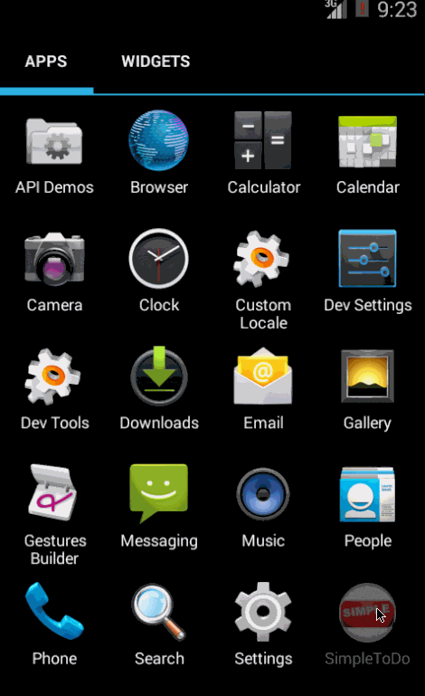

SimpleToDo
==========

Sample to do app

The features that are implemented are:

<ol>
<li> Enter the name of the ToDo item and add it to the list by clicking the 'add' button</li>
<li> The ToDo items can be deleted by doing a long clock on the item</li>
<li> Closing the app and opning the app retains the previous state of the list items</li>
<li> Items are written to a file on the app and read from when the app opens</li>
<li> When there is no item entered, the empty item is not added to the list and there is a Toast message</li>
<li> The list items are colored by using a Custom Adapter</li>
<li> Added an icon as the app icon </li>
</ol>

